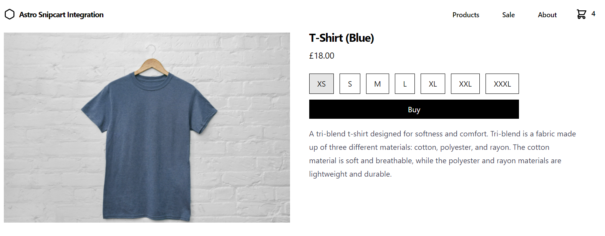

<h1 align="center">Welcome to astro-snipcart 👋</h1>
<p>
  
  <a href="https://astro-snipcart.vercel.app/en/introduction" target="_blank">
    
  </a>
  <a href="#" target="_blank">
    
  </a>
  <a href="https://twitter.com/lloydjatkinson" target="_blank">
    
  </a>
</p>

> Astro Snipcart allows developers to rapidly build E-Commerce sites using the Astro framework and the Snipcart platform. Create an e-commerce site with just a few lines of HTML and Astro components!

### 🏠 [Homepage](https://astro-snipcart.vercel.app/en/introduction)

### ✨ [Demo](https://astro-snipcart-playground.vercel.app/)


## Install Astro Snipcart

This provides you with a set of Astro components that allow you to define your products and enables checkout. They do not have any visual aspects, do not imply any sort of theme, and are up to you to work with. These are how your application and Snipcart interact.

```sh
npm install @lloydjatkinson/astro-snipcart
```

## (Optional) Install Astro Snipcart Design System

This builds upon (and depends upon Astro Snipcart) and provides an optional E-Commerce orientated [design system](https://www.nngroup.com/articles/design-systems-101/#:~:text=Definition%3A%20A%20design%20system%20is,using%20reusable%20components%20and%20patterns.) which you can use all or parts of as the foundation for your E-Commerce site. In fact, you can build real-world sites as shown in [this playground demo](https://astro-snipcart-playground.vercel.app/).

```sh
npm install @lloydjatkinson/astro-snipcart-design-system
```

Here's a brief example of what you can do with the design system:

```tsx
<Stack
    gap={{
        mobile: 'small',
        desktop: 'large'
    }}>
    <Text
        as="h1"
        size="xlarge"
        weight="strong"
        tracking="tighter">
        I'm some styled text!
    </Text>
    <Price
        currency="GBP"
        price={ 10 }
        originalPrice={ 12 }
        size="large" />
</Stack>
```


Which can be built up into real-world site designs:




## Development and build

This project is a monoepo. Additionally, it uses pnpm as it's package manager. The `packages` directory is where the source is contained. 

## Install

```sh
pnpm -r i
```

## Usage

```sh
pnpm run docs
pnpm run playground
```

## Format & Lint
```sh
pnpm -r format
pnpm -r lint
```

## Run tests

```sh
pnpm -r test
```

## Author

👤 **Lloyd Atkinson**

* Website: https://lloydatkinson.net
* Twitter: [@lloydjatkinson](https://twitter.com/lloydjatkinson)
* Github: [@lloydjatkinson](https://github.com/lloydjatkinson)

<!-- ## 🤝 Contributing

Contributions, issues and feature requests are welcome!<br />Feel free to check [issues page](https://github.com/lloydjatkinson/astro-snipcart/issues).  -->

## Show your support

Give a ⭐️ if this project helped you!